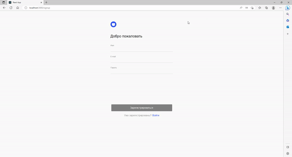
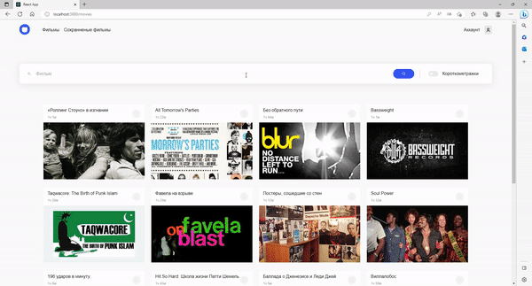
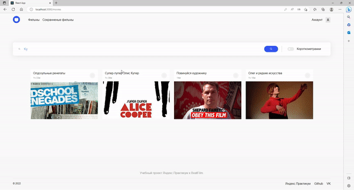

# Movies-explorer

Этот проект - **микро-аналог кинопоиска**, без просмотра фильмов. Поселдний проект в рамках курса от Яндекс Практикум.

## Фукнционал проекта

1. Каждый пользователь может зарегестрироваться, при этом данные валидируются, на **бэкэнде и фронтедне**
2. После регистрации можно **искать, сохранять и лайкать фильмы**, также можно отфильтровать фильмы по длительности.
3. **До регистрации доступна только главная страница** с информацией о проекте и обо мне. Роуты защищены, на бэке и на фронте.

## Технологии проекта

Фронтенд часть разработана на **React.js**, бэкенд на **Express.js вместе с MongoDB**

## Что мне нравится в этом проекте?

1. При создании проекта и верстки я придерживался методологии **БЭМ**, что позволяло делать блоки независимыми и переиспользовать их.
2. Верстка полностью адаптивная, и невероятно классно смотрится **на любом разрешениии**
3. Код React разбит на **функциональные компоненты**, каждый из которых выполняет только свою функцию
4. При регистрации либо авторизации пользователя **пароль скрыт**, но при нажатию на кнопку он **становится видимым**
5. Авторизация и регистрация пользователя работает через **куки**, что делает хранение данных более безопасным
6. **Пагинация**, которая при нажатии подгружает еще три карточки с фильмами.

## Как работает проект?

### Главная страница

### Регистрация

### Поиск фильмов

### Сохранение фильом и фильтр короткометражек

### Пагинация

### Мобильная версия

### От мобильной версии к декстопу

